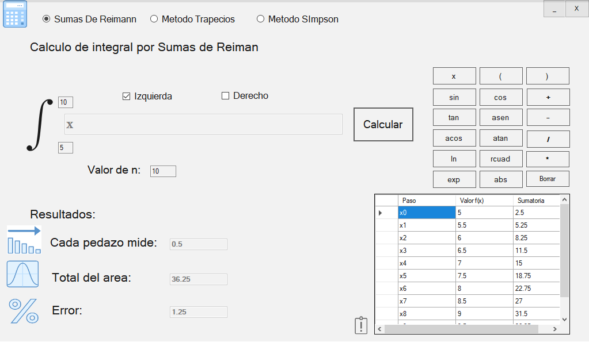

# Integración Numérica

_Hemos realizado una forma rápida y sencilla para resolver integrales definidas con los metodos de Riemann, Traprecios y Simpson, a travez del lengujae C#._

## Comenzando 🚀

_Estas instrucciones te permitirán obtener una copia del proyecto en funcionamiento en tu máquina local para propósitos de desarrollo y pruebas, sientete libre de modificarlo._

### Pre-requisitos 📋

_Necesitaras tener instalado (de preferencias) Visual Studio 2019 o cualquier version de Visual Studio para poder modificarlo._
